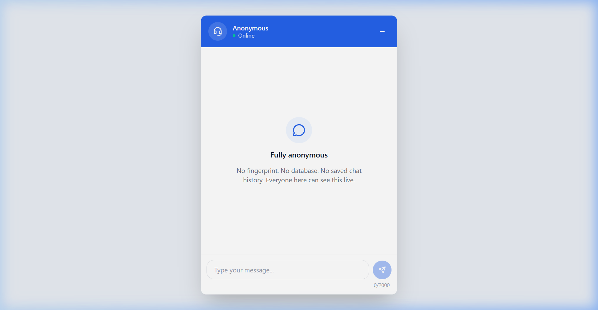

# DEVOPS PRACTICAL ASSIGNMENT — CI/CD, CONTAINERIZATION & GITOPS DELIVERY

**Reference Application**: Support Chat Platform — `simple-vite-front` (React/Vite Frontend)  
**Repository**: [https://github.com/sujanustc/ostad-capstan-frontend](https://github.com/sujanustc/ostad-capstan-frontend)  
**Backend Repository**: [https://github.com/sujanustc/ostad-capstan-backend](https://github.com/sujanustc/ostad-capstan-backend)  
**Docker Hub Registry**: [https://hub.docker.com/repositories/dasujandb](https://hub.docker.com/repositories/dasujandb) (`dasujandb`)  
**Target Environment**: AWS EC2 (`13.203.161.35`) running K3s & Argo CD  

---

## 🖼️ LIVE APPLICATION DEMONSTRATION

*Figure 1: Live Support Chat application running on Kubernetes across AWS EC2 (`http://13.203.161.35:30022`).*

---

## 📄 WRITTEN ENGINEERING NOTE: DECISIONS & RATIONALE

This document serves as the official project submission note explaining the architectural and engineering decisions made throughout the delivery pipeline implementation.

### 1. Source Control & Branching Strategy
We implemented a long-lived environment-branching model consisting of three core branches: **`dev`**, **`stage`**, and **`prod`**.

* **`dev` Branch**: Baseline integration branch. Feature branches merge into `dev` via Pull Requests. It represents active development.
* **`stage` Branch**: Pre-production validation branch. Code is promoted from `dev` to `stage` via PR after development verification.
* **`prod` Branch**: Production release state. Code promotion occurs strictly via Pull Requests from `stage`.

**Rationale**: This branching model mirrors physical environment separation, providing a transparent promotion path (`feature` → `dev` → `stage` → `prod`) inspectable by any engineer through Git branch history without external documentation.

---

### 2. Continuous Integration & Continuous Delivery (CI/CD) Triggers

Per the assignment's non-negotiable constraints:

* **Dev & Stage Environments (Manual Trigger)**:
  * Pushing code to `dev` or `stage` automatically triggers CI linting, type-checking, building, and pushing Docker images (`dasujandb/support-chat-frontend:${ENV}-${SHA}-${TIMESTAMP}`).
  * However, deployment to the running Kubernetes environment requires an explicit **manual human decision** (triggered via GitHub Actions `workflow_dispatch` or manual Argo CD Application sync).
  * *Rationale*: Prevents unreviewed or in-progress code from automatically overwriting running dev/stage environments.

* **Production Environment (Automatic Trigger on PR Open)**:
  * Opening a Pull Request targeting `prod` automatically triggers the production build pipeline (`ci-cd-prod-auto.yml`).
  * The pipeline builds optimized production containers (`nginx:alpine`), updates the Kubernetes deployment manifest image tags in `k8s/prod/frontend.yaml`, and commits back to Git.
  * Argo CD (with `automated` sync policy enabled for `prod`) instantly reconciles the live production cluster state.
  * *Rationale*: Opening a PR to `prod` represents the explicit decision to release; automating validation, image tagging, and deployment upon PR creation ensures a zero-friction, auditable production deployment without separate manual deployment steps.

---

### 3. Containerization & Versioning Scheme

Two distinct Dockerfiles were engineered for the frontend:

* **Development Image (`Dockerfile.dev`)**:
  * Runs Vite dev server with hot reloading enabled (`NODE_ENV=development`).
  * Optimized for rapid iteration and live developer debugging.

* **Production Image (`Dockerfile.prod`)**:
  * Multi-stage build process.
  * **Stage 1**: Compiles Vite assets (`npm run build`) with target environment API/Socket URLs.
  * **Stage 2**: Serves built static assets via lightweight, production-tuned `nginx:alpine`.

* **Traceable Versioning Scheme**:
  * Format: `${ENVIRONMENT}-${GIT_COMMIT_SHA_SHORT}-${BUILD_TIMESTAMP}`
  * Example Tag: `prod-8baeeea-202608270208`
  * *Rationale*: Avoids ambiguity caused by mutable `latest` tags, guaranteeing exact auditability back to the source commit and build date months later.

---

### 4. Kubernetes Delivery (Workloads & Services, No Ingress)

* **Cluster Infrastructure**: K3s installed on AWS EC2 (`13.203.161.35`), providing a lightweight, CNCF-compliant Kubernetes runtime.
* **Namespace Isolation**: Workloads are isolated into `dev`, `stage`, and `prod` Kubernetes namespaces.
* **Networking (No Ingress)**:
  * Per assignment constraints prohibiting Ingress resources, external exposure is achieved via **NodePort** services.
  * **Port Mapping**:
    * `dev`: Frontend NodePort `30002` (Backend NodePort `30001`)
    * `stage`: Frontend NodePort `30012` (Backend NodePort `30011`)
    * `prod`: Frontend NodePort `30022` (Backend NodePort `30021`)

---

### 5. GitOps Delivery via Argo CD

* **Argo CD UI**: Accessible at `https://13.203.161.35:30808`.
* **Declarative Management**: 6 Argo CD Application manifests monitor the `k8s/` manifests directory in Git.
* **Sync Policies**:
  * `support-chat-frontend-dev` & `stage`: `Manual` Sync Policy.
  * `support-chat-frontend-prod`: `Automated` Sync Policy (`prune: true`, `selfHeal: true`).

---

### 6. Observability & Alerting (Bonus Extension)

Integrated an automated Telegram notification step into `.github/workflows/ci-cd-prod-auto.yml` that posts real-time deployment alerts (repo, target environment, container image tag, and Argo CD sync status) directly to a Telegram channel upon production releases.

---

## 🌐 LIVE DEPLOYMENT ACCESS MATRIX (AWS EC2: 13.203.161.35)

| Environment | Component | Public URL | NodePort | Argo CD Sync Policy |
| :--- | :--- | :--- | :--- | :--- |
| **Dev** | **Frontend UI** | [http://13.203.161.35:30002](http://13.203.161.35:30002) | `30002` | Manual |
| **Dev** | **Backend API** | [http://13.203.161.35:30001/api/config/chat](http://13.203.161.35:30001/api/config/chat) | `30001` | Manual |
| **Staging** | **Frontend UI** | [http://13.203.161.35:30012](http://13.203.161.35:30012) | `30012` | Manual |
| **Staging** | **Backend API** | [http://13.203.161.35:30011/api/config/chat](http://13.203.161.35:30011/api/config/chat) | `30011` | Manual |
| **Production** | **Frontend UI** | [http://13.203.161.35:30022](http://13.203.161.35:30022) | `30022` | Automated |
| **Production** | **Backend API** | [http://13.203.161.35:30021/api/config/chat](http://13.203.161.35:30021/api/config/chat) | `30021` | Automated |
| **Platform** | **Argo CD UI** | [https://13.203.161.35:30808](https://13.203.161.35:30808) | `30808` | N/A |
